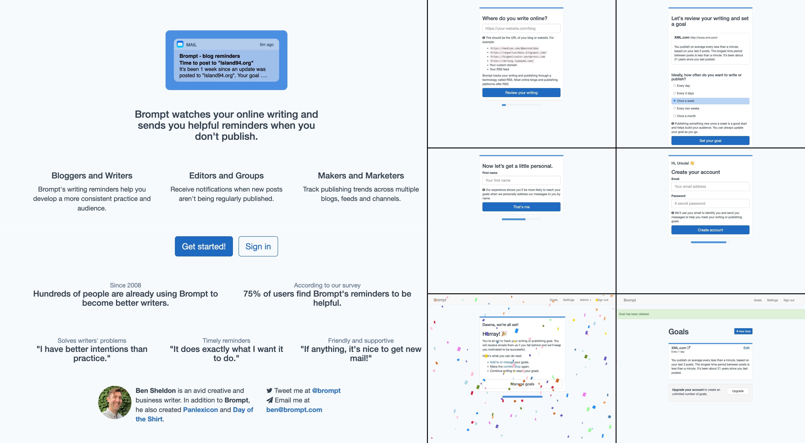

# Brompt.com

Brompt watches your online writing and sends you helpful reminders when you don't publish.

Brompt was run as a webservice from 2008 to 2024, built initially as a Drupal application and later converted to Ruby on Rails. You can read more about it in these posts from wrote about in [2008](https://island94.org/2008/04/Brompt-is-a-blog-reminder.html), [2011](https://island94.org/2011/03/A-form-from-my-favorites.html), [2022](https://island94.org/2022/09/reflections-on-brompt-2022), and [2024](https://island94.org/2024/02/farewell-brompt).

## Development setup

This code is offered for historical reference and curious eyes. **I can't commit to maintaining it.** It requires:

- Ruby and Bundler
- PostgreSQL
- An SMTP email provider
- NodeJS to compile the (minimal) frontend assets

Configuration can be found in `config/secrets.yml`. 

Some commands you might run:

- `bin/setup`
- `bin/rails s`
- `bin/rspec`
- `bin/lint`
